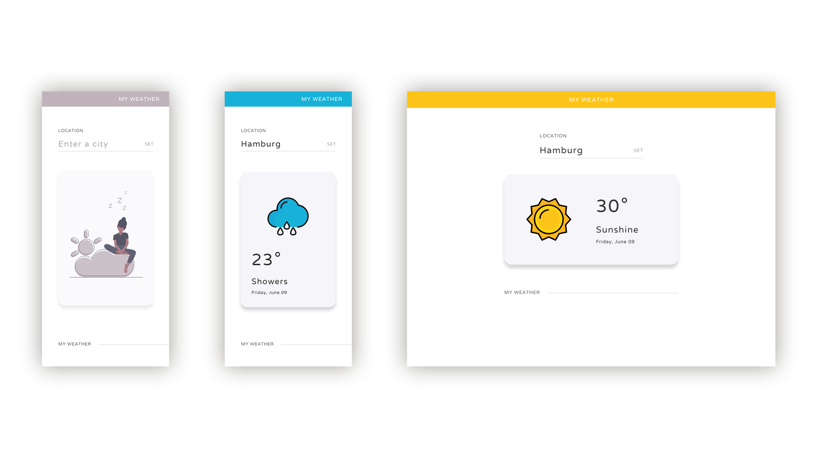
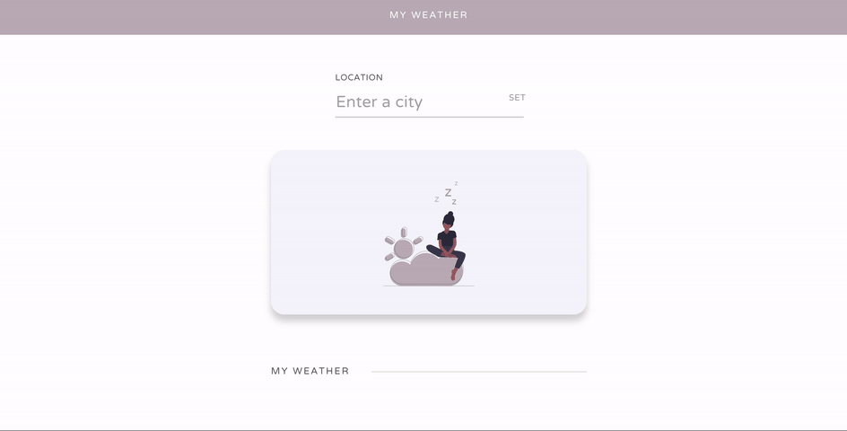

# Simple Weather App

The Objective here is to create a simple weather app as shown below.

## Web App Demo: 

## Notes:
1. The Web app Should be Responsive.
2. Please use the [assets](/assets/) provided
3. Do atomic commit as an when any feature is completed
4. You could use any Web Framework/ Technologies (Angular/ React/ Vue). If the recruiter instructs otherwise, please follow the tech stack provided by the recruiter!
5. Use [OpenWeather API](https://openweathermap.org/api) for weather data
